# 基于ssm的网上商城

#### 介绍

改进别人的ssm网上商城，目前仍在维护和改进

软件架构：基于ssm+maven

喜欢就给个star吧~

#### 使用说明

1.  测试时使用jdk1.8
2.  sql语句已经放在eb.sql文件中，数据库名称：eb
3.  配置一个tomcat就可以访问了
4.  不懂的可以发邮件一起互相讨论，相互学习

#### 注意事项

##### **关于CSS样式、图片无法加载的问题**

说明：项目的结构不要弄错了！项目名：`ssmstudy` 请用idea等编译器导入这个目录。

##### **关于首页各种无法加载的问题**

说明：Tomcat不要配置错了！

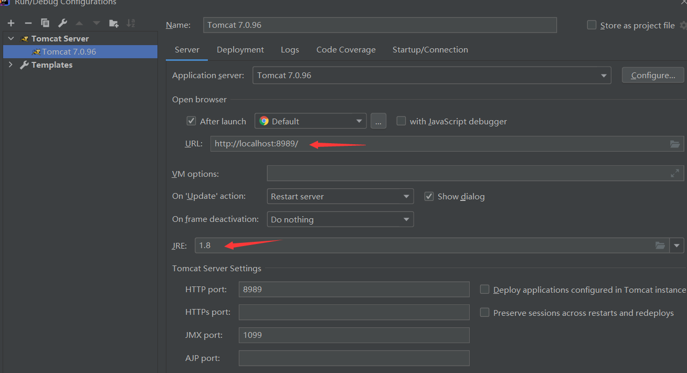
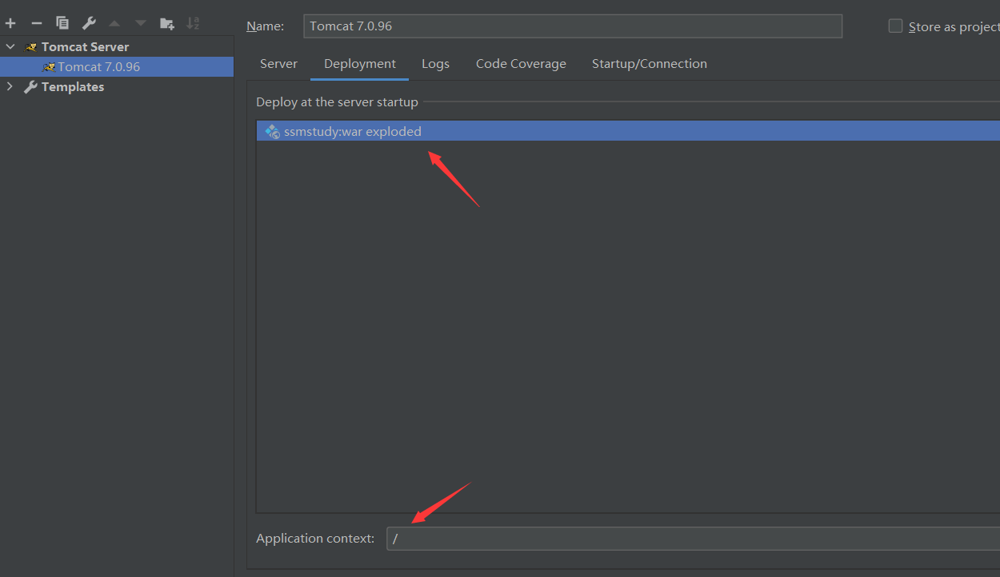
#### 演示

#####       登录界面

#####        主界面

#####        购物演示

​             （包括下单支付）：

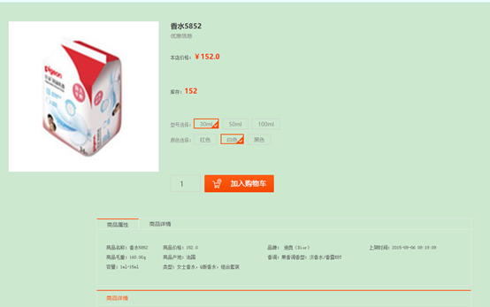

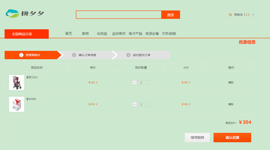

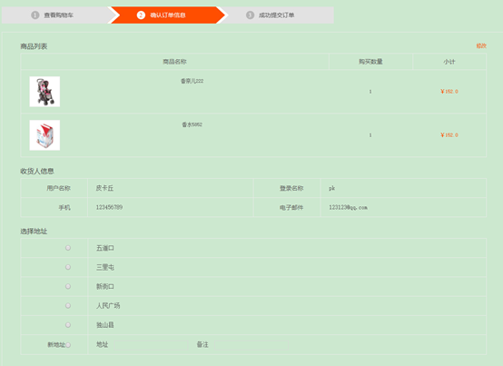

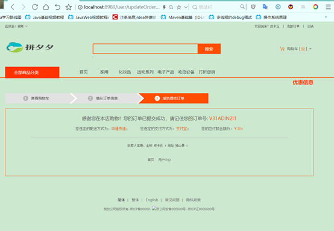

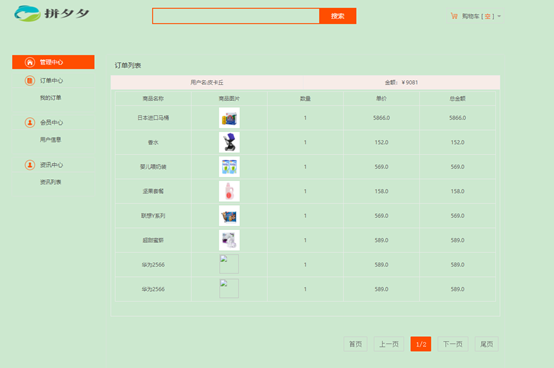

#### 项目结构

#####         数据库结构

​                       数据库名称：eb      所有数据表见下图的右边

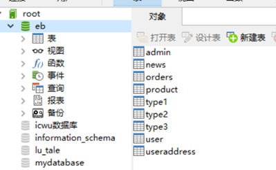

#####           主要代码结构：

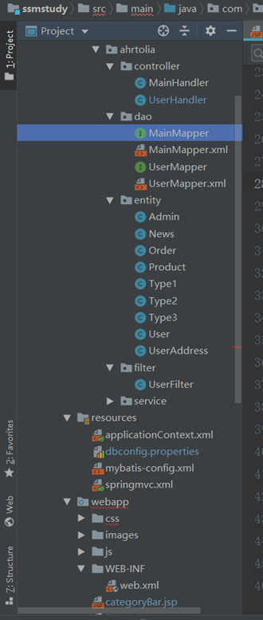

#####        Mapper

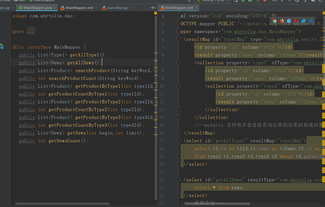

#####        Services层

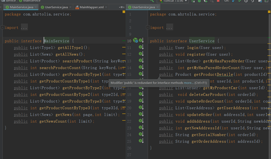

#####       所有前端页面

